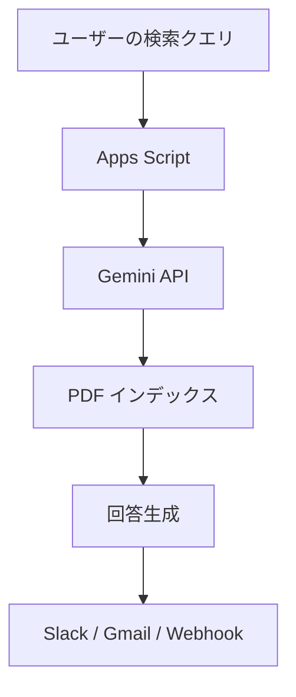

<div align="center">

# 🌐 gas-gemini-filesearch-api-webpdf


</div>

> 📄 Google Apps Script で Gemini API を呼び出し、PDF を全文検索できる Slack / Chatbot 連携向けユーティリティ。少ないコードでドキュメント検索の PoC を素早く立ち上げられるよ！

## 📑 目次
- [✨ プロジェクト概要](#-プロジェクト概要)
- [🚀 主な機能](#-主な機能)
- [🛠️ 技術スタック](#️-技術スタック)
- [📂 リポジトリ構成](#-リポジトリ構成)
- [⚙️ セットアップ](#️-セットアップ)
- [🧪 動作確認](#-動作確認)
- [📝 使用方法](#-使用方法)
- [🌐 デプロイ手順](#-デプロイ手順)
- [🔒 環境変数とセキュリティ](#-環境変数とセキュリティ)
- [🧭 よくある質問](#-よくある質問)
- [🤝 コントリビュート](#-コントリビュート)
- [📄 ライセンス](#-ライセンス)

## ✨ プロジェクト概要
- Gemini API を利用して PDF を解析・全文検索する Google Apps Script プロジェクトだよ。
- Google Drive 上の PDF を読み込み、インデックス化して検索クエリに応じた回答を生成するよ。
- Google Workspace の自動化、Slack 連携、ドキュメントアシスタントの構築に最適！

## 🚀 主な機能
- ✅ PDF のテキスト抽出と要約生成
- ✅ Gemini API を使った高度な自然言語検索
- ✅ Apps Script からの外部 API 呼び出しテンプレート
- ✅ 環境変数（Script Properties）管理のベストプラクティス

## 🛠️ 技術スタック
| カテゴリ | 使用技術 |
| --- | --- |
| 言語 | Google Apps Script (JavaScript) |
| API | Google Gemini API, Google Drive API |
| ビルド / デプロイ | Apps Script IDE, clasp (任意) |
| ドキュメント | Markdown, Mermaid |

## 📂 リポジトリ構成
```bash
.
├── README.md              # このドキュメント
├── appsscript.json        # Apps Script プロジェクト設定
└── code.gs                # メインスクリプト（Gemini 呼び出し＋PDF 検索）
```

## ⚙️ セットアップ
1. 📁 Google Drive に対象の PDF をアップロードする。
2. 🧪 Google Gemini API と Google Drive API を有効化して、API キーを取得する。
3. 🔑 Apps Script プロジェクトの Script Properties に `GEMINI_API_KEY` を設定する。
4. 💻 `clasp` を利用する場合はローカルにプロジェクトを clone し、`clasp login` → `clasp push` でデプロイする。

## 🧪 動作確認
1. Apps Script IDE の `code.gs` を開き、`main` 関数を実行。
2. 初回実行時は UrlFetchApp などの OAuth 権限を付与する。
3. ログに File Search ストア名と Gemini のレスポンス JSON が出力されれば成功だよ。



## 📝 使用方法
1. `main()` 関数を実行すると、PDF 取得 → ストアへの登録 → Gemini への問い合わせまでを一括で実施するよ。
2. `CONFIG` オブジェクトで `PDF_URL` や `MODEL` を調整して、目的に合うドキュメントを指定しよう。
3. 既存のワークフローに組み込みたい場合は、`askWithFileSearch_()` や `createFileSearchStore_()` を必要に応じて呼び出してね。

## 🌐 デプロイ手順
1. Apps Script のトリガーで `main` もしくは必要なカスタム関数を定期実行に設定。
2. Web アプリとしてデプロイする場合は、HTTP リクエストから `main` を呼び出すハンドラーを追加してね。
3. Slack Slash Command などの外部サービスと連携する際は、生成したエンドポイント URL を Webhook に登録しよう。

## 🔒 環境変数とセキュリティ
- 機密情報は必ず Script Properties（`PropertiesService.getScriptProperties()`）に保存してね。
- GitHub には `.clasp.json` や `client_secret.json` をコミットしないよう `.gitignore` に追加すること。
- API キーのローテーションポリシーを決めて、定期的に更新するのが安心だよ。

## 🧭 よくある質問
**Q. PDF の言語が混在している場合はどうするの？**  
A. Gemini API は多言語対応なので、自動で言語判定してくれるよ。必要に応じて `languageHints` を指定しよう。

**Q. 大容量 PDF は扱える？**  
A. 事前に Drive API でファイルサイズをチェックして、分割して処理すると安定するよ。

## 🤝 コントリビュート
1. Issue を立てて改善内容を共有してね。
2. フォークしてブランチを作成。
3. コードスタイルを守り、テスト用のサンプルを追加してプルリクを送ってね。

## 📄 ライセンス
このプロジェクトは [MIT License](LICENSE) のもとで提供されているよ。
